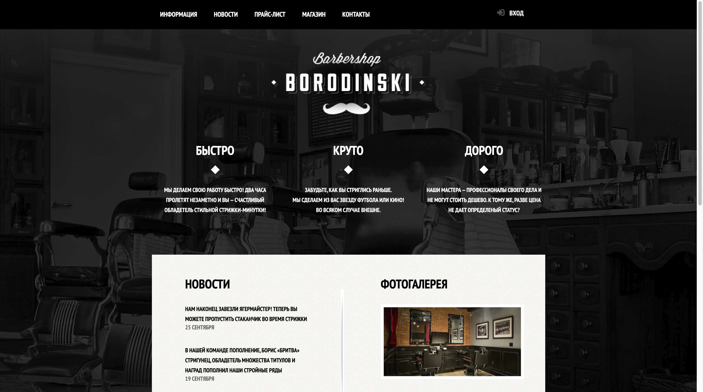
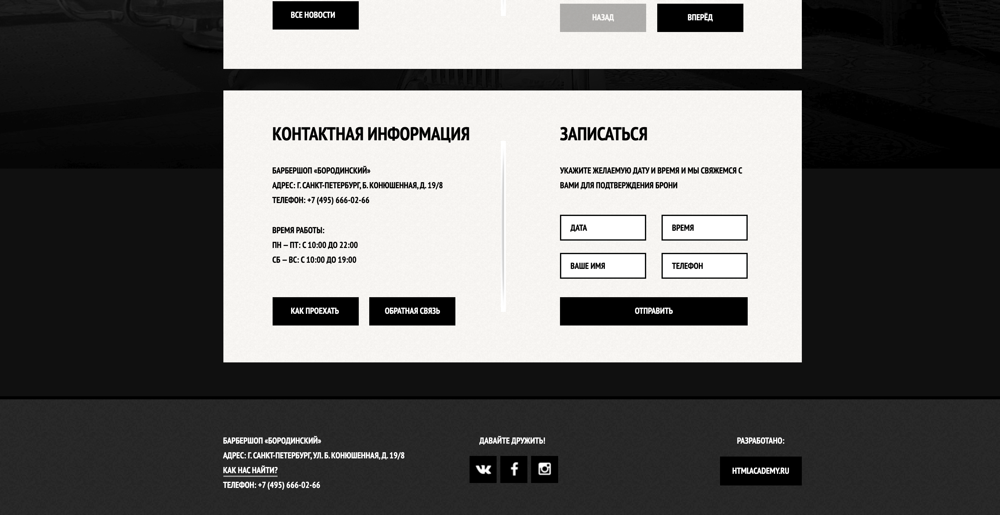
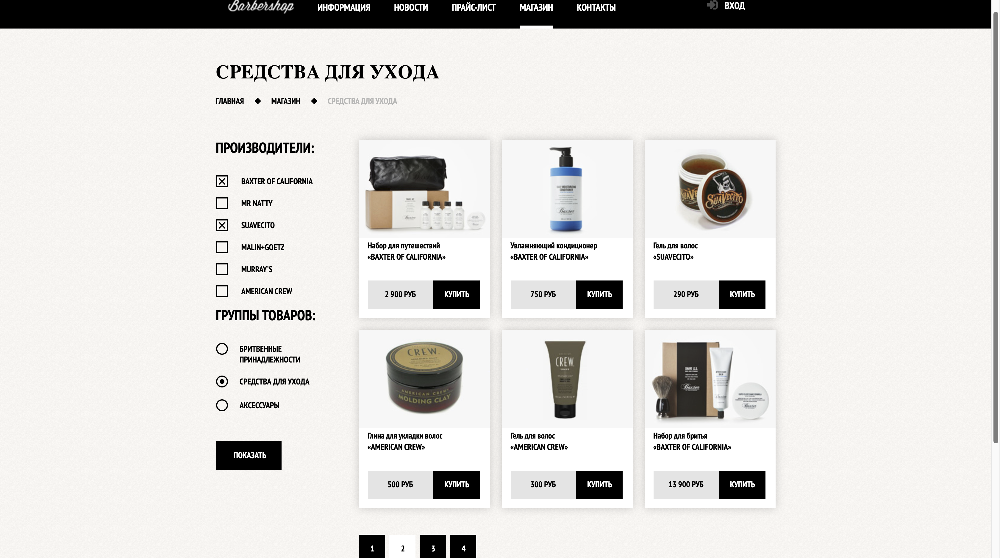

# BARBERSHOP template

### Table of Contents

- [Description](#description)
- [Preview](#preview)
- [How To Use](#how-to-use)
- [Author info](#author)

## Description

Frotend works is done with no framework or library. This template is reflection of everything i know about HTML and CSS. While coding i gained experience in working with Photoshop. No icon fonts. Instead i used sprites for better perfomance. Works well on every modern browser like Chrome, Firefox, Safari. One more cool thing about this template is custom checkboxes and radio buttons.
Javascript is used for getting events and respoding on them. Also for viewing different gallery and shop images.

#### Technologies

- HTML5
- CSS3
- Javascript(ES6)
- Photoshop (for .psd files)

---

## Preview

      

---

## How to use

Just download or clone package from https://github.com/Alex-2kZharkov/Barbershop-template.git and RUN index.html

## Author info

Write me to alexander.06.zharkov@gmail.com if you have any thoughts about this project or something like internship/job offer

